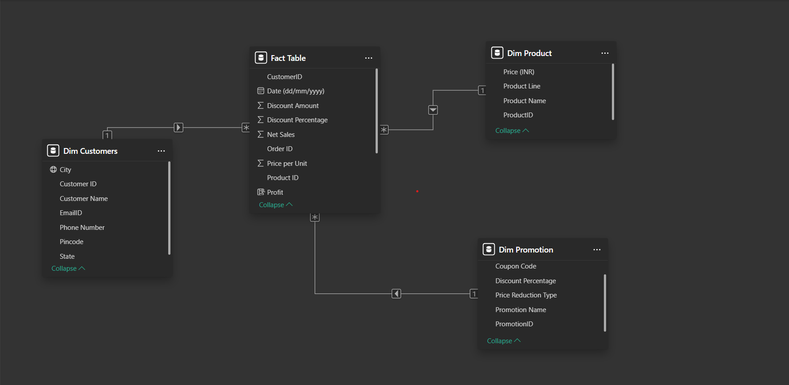
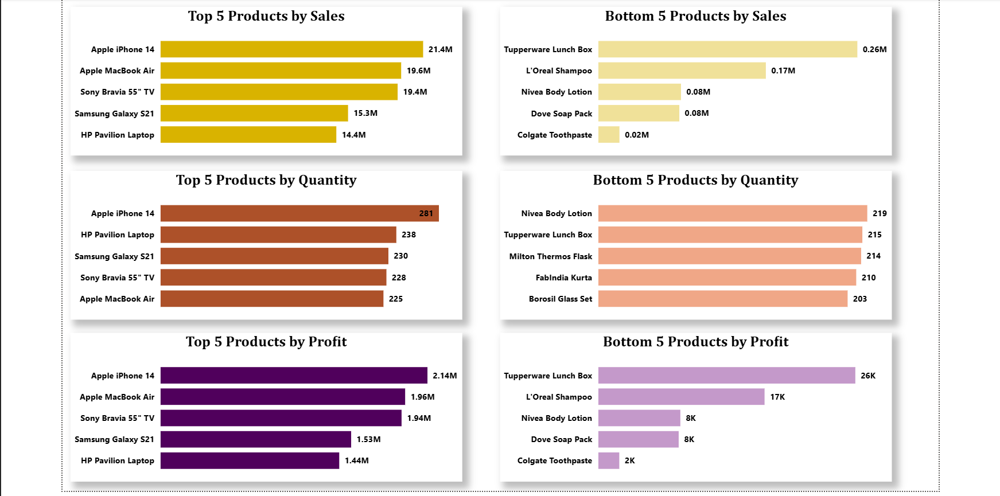
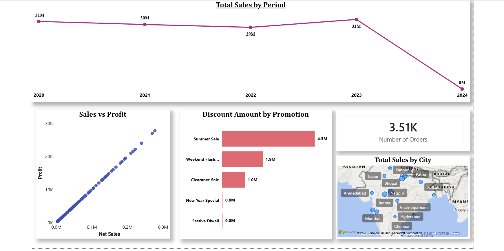
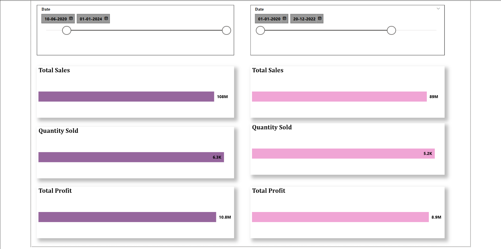
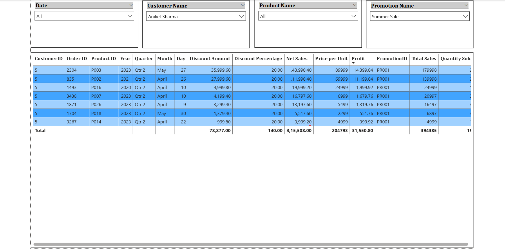

# 📊 Sales Performance Reports/Dashboard (Power BI)

## 📌 Overview
This project presents an interactive Power BI reports/dashboard designed to analyze sales performance, product trends, and regional distribution. It focuses on transforming raw data into meaningful business insights through data preparation, modeling, and visualization.

---

## ⚙️ Key Features
- Top/Bottom 5 products by Sales, Profit, and Quantity Sold  
- Sales trends analysis (Monthly, Quarterly, Yearly)  
- Sales vs Profit relationship visualization  
- City-wise sales distribution  
- Interactive filtering by Product, Date, Customer, and Category  

---

## 🛠️ Tools & Technologies
- Power BI  
- Power Query (Data Transformation)  
- Data Modeling  

---

## 🧩 Data Model (Star Schema)
This project follows a **star schema** with a central fact table connected to multiple dimension tables, ensuring efficient data analysis and scalability.

- Designed using **Fact and Dimension tables**  
- Established relationships for optimized reporting  

---

## 📷 Report Screenshots

---

## 📂 Project Files
- Power BI report file (`.pbix`)  
- Dataset (`Store+Data.xlsx`)  
- Report screenshots  
- Data model image  

---

## 🚀 How to Use
1. Download the `.pbix` file  
2. Open using Power BI Desktop  
3. Interact with filters and visuals to explore insights  

---

## 🎯 Key Learnings
- Data transformation using Power Query  
- Designing star schema data models  
- Building interactive dashboards for business insights  
